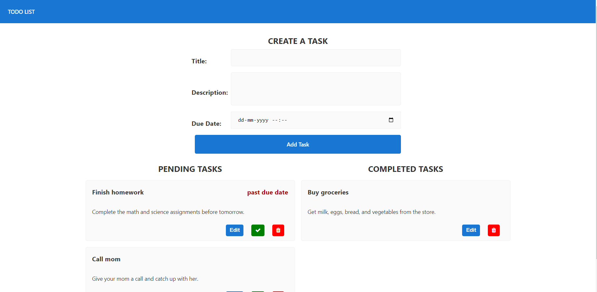

# Todo App Using Angular, Node and mysql

This project is created for TRIAS assignment. The frontend folder contains the Angular JS code and the backend folder contains the Express Js code for the application.

## Setting Up

### Database
Create a database for this application
```bash
mysql -u <username> -p
```

```mysql
CREATE TABLE `todo_db`.`todo_list` (
`id` int not null auto_increment ,
`title` varchar(50) not null ,
`descrip` varchar(100) not null ,
`datetime_created` datetime default CURRENT_TIMESTAMP ,
`datetime_due` datetime not null,
`stat` varchar(20) default "pending",
primary key(`id`)
) ENGINE=InnoDB auto_increment=0 default charset=utf8mb4 collate=utf8mb4_0900_ai_ci;

```

### Backend

Navigate to the backend folder and install the dependencies and run the code. U can access your backend api from http://localhost:3000/api/todo

```bash
npm install
npm start
```

### Frontend

Navigate to the frontend folder and install the dependencies and run the code by passing proxy options. http://localhost:4200

```bash
npm install
ng serve
```

## Screenshots

### App Page


### Mat Dialog Box


### Edit feature


### Backend Data

